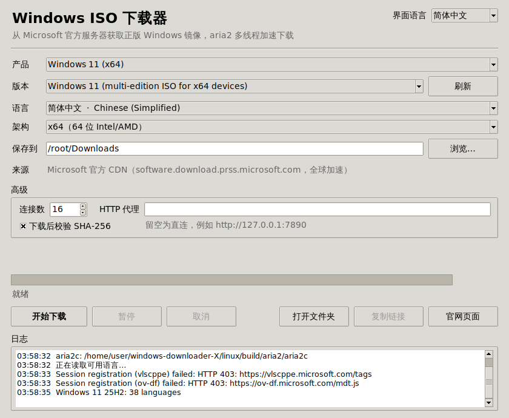

# Windows ISO 下载器 · WinISO Downloader

一个带图形界面的 Windows 官方 ISO 镜像下载器，Windows、macOS、Linux 三个平台都能双击运行。

- **官方来源**：直接调用 Microsoft 官网下载页（microsoft.com/software-download）背后的同一套接口，镜像来自微软自己的全球 CDN `software.download.prss.microsoft.com`，全球各地都能快速访问。
- **aria2 加速**：内置 [aria2](https://aria2.github.io/)，默认 16 线程分段下载，支持暂停、继续和断点续传。
- **自动校验**：下载完成后，用微软官网公布的 SHA-256 自动校验文件完整性。
- **中英双语**：界面语言自动跟随系统，也可以手动切换。



## 支持下载的镜像

| 产品 | 架构 | 语言 |
|---|---|---|
| Windows 11（最新版，目前为 25H2） | x64 | 38 种 |
| Windows 11 Arm64（最新版） | Arm64 | 38 种 |
| Windows 10 22H2 | x64 / x86 | 38 种 |
| 自定义链接 | 任意 | 粘贴任意 ISO 直链，同样用 aria2 下载 |

版本列表是运行时从微软官网实时读取的，微软发布新版本后程序无需更新。

## 下载和运行

构建好的程序在 [Releases](../../releases) 页面（推送 `v*` 标签后由 CI 自动发布），也可以在 [Actions](../../actions) 的构建记录里下载 Artifacts。

| 平台 | 文件 | 运行方式 |
|---|---|---|
| Windows 10/11 x64 | `WinISO-Downloader.exe` | 双击运行（单文件，免安装） |
| macOS 10.13+（Apple 芯片和 Intel 通用） | `WinISO-Downloader-macOS.dmg` | 打开 DMG，把 App 拖进“应用程序”后双击 |
| Linux x86_64 / aarch64 | `WinISO-Downloader-linux-<架构>.tar.gz` | 解压后双击 `.AppImage` |

首次运行时的系统提示（程序没有购买代码签名证书，属于正常现象）：

- **Windows**：如果出现“Windows 已保护你的电脑”，点 **更多信息 → 仍要运行**。
- **macOS**：如果提示“无法验证开发者”，打开 **系统设置 → 隐私与安全性**，点 **仍要打开**；或者在终端执行 `xattr -dr com.apple.quarantine "/Applications/WinISO Downloader.app"`。
- **Linux**：如果直接下载 `.AppImage` 后无法双击，先在文件属性里勾选“允许作为程序执行”，或执行 `chmod +x WinISO-Downloader-*.AppImage`（用 `.tar.gz` 包就不会有这个问题）。

## 使用方法

1. 选择 **产品 → 版本 → 语言 → 架构**，版本和语言会自动从微软官网读取。
2. 选择保存目录，点 **开始下载**。
3. 程序向微软申请一个 24 小时内有效的官方下载链接，交给 aria2 多线程下载。
4. 下载完成后自动校验 SHA-256，结果会显示在界面和日志里。

未下载完的文件会保留下来。下次选择同一个镜像再点“开始下载”，会自动断点续传（程序会重新申请链接，所以链接过期也不影响）。

### 遇到“Microsoft 拒绝了本次请求（715-123130）”

这是微软的反滥用系统在拦截，常见原因是使用了代理 / VPN、数据中心 IP，或者请求过于频繁。解决办法：

1. 关闭代理或 VPN，并把“高级 → HTTP 代理”清空后重试；
2. 等几分钟后再试；
3. 点“官网页面”在浏览器里获取下载链接，再选择产品“自定义链接”粘贴，照样用 aria2 加速下载。

## 目录结构

```
common/winiso/   三个平台共用的程序代码（界面、微软接口、aria2 控制、校验）
windows/         Windows 版：构建脚本 build.ps1 / build.bat、图标、版本信息
macos/           macOS 版：构建脚本 build.sh、aria2 通用二进制编译脚本、图标
linux/           Linux 版：构建脚本 build.sh、静态 aria2 编译脚本、AppImage 配置
tools/           图标生成、微软接口联网测试脚本
old/             旧版代码（C++ 控制台程序，已弃用）
.github/workflows/build.yml   CI：三平台自动构建、自测、发布
```

三个平台共用一份代码，所以功能和修复都能同步。各平台目录只放各自的打包方式和 aria2 的获取方式：

| 平台 | 打包 | aria2 来源 |
|---|---|---|
| Windows | PyInstaller 单文件 exe | aria2 官方 Windows 构建（校验 SHA-256） |
| macOS | PyInstaller `.app` + DMG（universal2） | 从官方源码编译 arm64 + x86_64 并合并，只依赖系统框架 |
| Linux | PyInstaller + AppImage | 在 Alpine 容器里从官方源码编译的 musl 静态版本 |

## 从源码构建

各平台都需要 Python 3.9+（含 Tk），具体步骤见各目录下的 README：

- [windows/README.md](windows/README.md)：运行 `windows\build.bat`
- [macos/README.md](macos/README.md)：运行 `bash macos/build.sh`
- [linux/README.md](linux/README.md)：运行 `bash linux/build.sh`（需要 Docker）

也可以不打包，直接从源码运行（需要系统里已安装 `aria2c`）：`python3 linux/main.py`（其他平台把目录名换成 windows / macos）。

## 许可与声明

- 本程序只从 Microsoft 官方服务器下载镜像，不修改镜像内容。Windows 是 Microsoft Corporation 的商标，本项目与 Microsoft 无关。
- 程序内置的 aria2 采用 GPL-2.0-or-later 许可；它的源码地址和编译方式见各平台的 `build-aria2.sh` / `build.ps1`。
